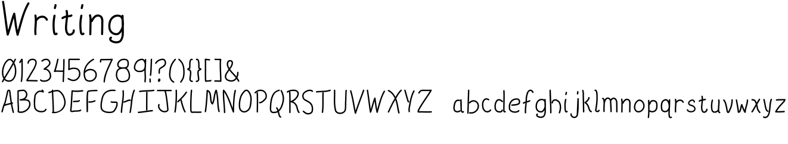

# writing
A simple handwriting-style font. It was designed for a character cell
display, so there is no kerning information. This unfortunately
makes some character pairs (like "Wr") look awkward.

